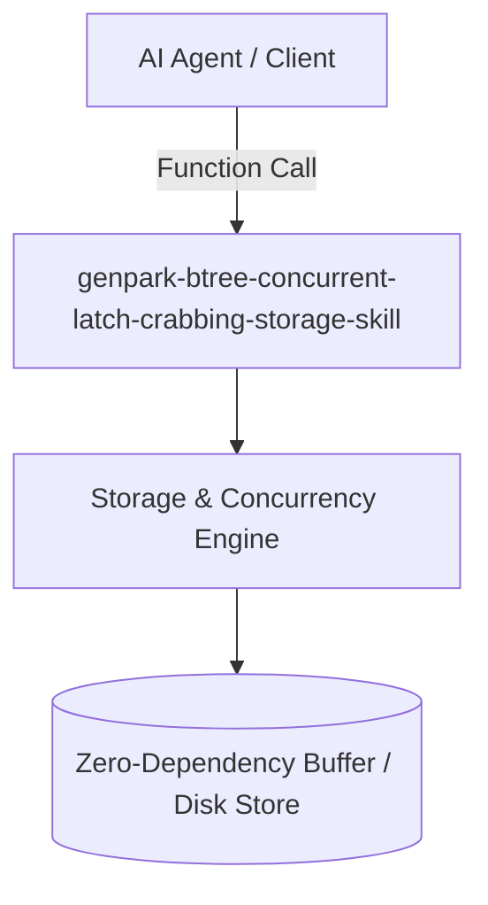

# genpark-btree-concurrent-latch-crabbing-storage-skill

[](https://github.com/alphaparkinc/genpark-btree-concurrent-latch-crabbing-storage-skill/actions)
[](https://opensource.org/licenses/MIT)
[](https://www.python.org/downloads/)

> Concurrent B+ Tree storage engine implementing latch crabbing protocols, internal node splitting, leaf chaining, and buffer page allocation.

## Architecture



## Features
- Pure standard library Python implementation with strictly zero pip dependencies.
- Production-grade algorithms with rigorous type safety and clear abstraction boundaries.
- Native Model Context Protocol (MCP) server integration for seamless AI agent orchestration.

## Installation

```bash
git clone https://github.com/alphaparkinc/genpark-btree-concurrent-latch-crabbing-storage-skill.git
cd genpark-btree-concurrent-latch-crabbing-storage-skill
```

## Quickstart

```bash
python example_usage.py
```
